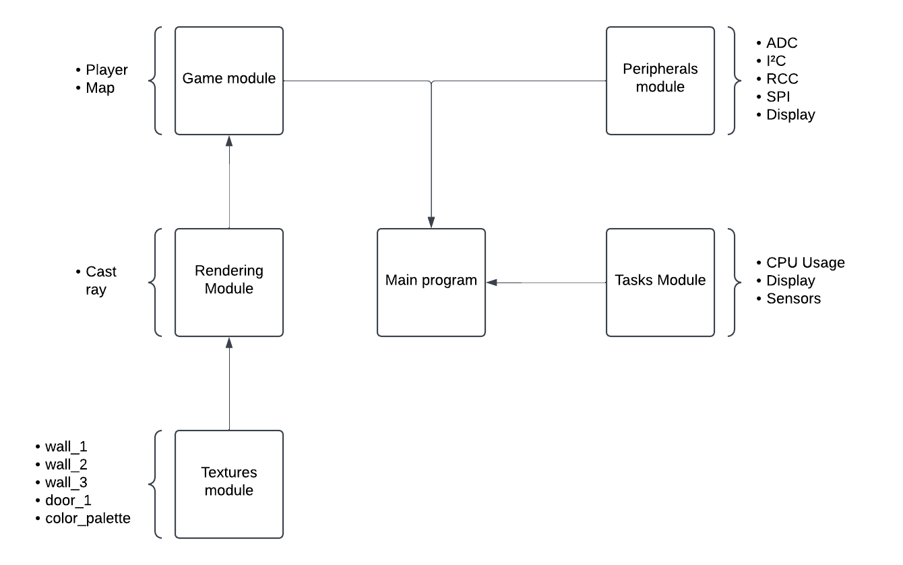
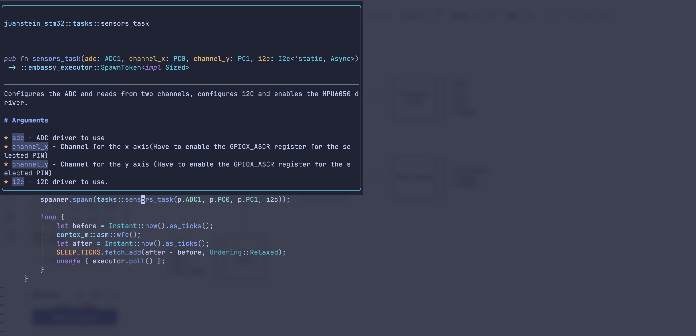

# JuanStein for stm32

This repo is a wolfstein-like game developed to run on an STM32

## Features:
* Developed in rust using the [Embassy](https://github.com/embassy-rs/embassy/tree/main) framework, which enables to create concurrent tasks using asynchronous programming. 
* Incorporation of textures in the raycaster engine.
* The player is moved using a joystick, you cand set the direction of it via a gyroscope.
* You can design a map that has doors and walls.
* Use of forked [`mipidsi`](https://github.com/J-Guevara12/mipidsi) crate for ehanced performance.
* Use of the `micromath` crate to perform approximation-based mathematic functions (more of it later).

## Hardware used:
* **ili9341:** SPI-based RGB Display.
* **mpu6030:** Accelerometer and gyroscope used to display the drive the player inclination.
* **Joystick** Two degrees of freedom joystick used to update the player's position.

## Project architecture

The project is divided in 5 different packages:

* **Game:** Contains the business logic specific to this project (map, player movement mechanics)
* **Rendering:** Implements the ray casting algorithm with an extra information related on where the ray hit, this is later used to render every object as a textured one.
* **Textures:** Each file contains the traslated version of the texture to be displayed.
* **Peripheral:** Abstracts the peripheral configuration and intialization.
* **Tasks:** Contains the cyclical tasks that have to be concurrently executed, this packages depends on the rest of the packages to work as expected.



For further information in any of the packages you can go its directory, there you will find a `README.md` file that extends the information.

## Approximation based mathematic functions

In digital systems, implementing the combinational logic to get certain floating-point mathematic functions like `sin`, `cos`, `tan`, `log` can be difficult, so many CPU cycles and processing are required to get precise values of such functions, on embedded systems where resources are limited that is not always the best approach, on certain graphis and signal processing use cases you can get a better performance with the tradeoff of a lost of precision.

[Micromath](https://docs.rs/micromath/latest/micromath/) is a crate that takes this approach.

### Example: Cosine function

On regular processors, trygonometric functions like sine or cosine can take p to hundreds of CPU Cycles to return a value.

Micromath approximates the cosine function with the following function:

``` rust
impl F32 {
    /// Approximates `cos(x)` in radians with a maximum error of `0.002`.
    pub fn cos(self) -> Self {
        let mut x = self;
        x *= FRAC_1_PI / 2.0;
        x -= 0.25 + (x + 0.25).floor().0;
        x *= 16.0 * (x.abs() - 0.5);
        x += 0.225 * x * (x.abs() - 1.0);
        x
    }
}
```
As you can see, only 13 operations are required for this value to be returned, when you have to process a signal with a high sampling rate the number of CPU Cycles required can make a great difference on the final result.

## Documentation:

All the functions in this repo are documented with a docstring according to the rust-language standard, this enables for an improved autocompletion experience and real time documentation:


